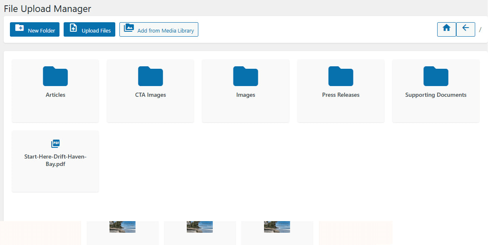

# File Explorer WordPress Plugin

<p align="center">
  
  
  
  
</p>

<p align="center">
  A modern, Windows Explorer-inspired file management experience for WordPress administrators and site visitors. The plugin adds an intuitive admin interface plus a fully responsive frontend shortcode for browsing, uploading, and sharing files stored under <code>wp-content/uploads/downloads</code>.
</p>

---

## Table of Contents

1. [Features](#features)
2. [Developer](#developer)
3. [Requirements](#requirements)
4. [Installation](#installation)
5. [Usage](#usage)
6. [Project structure](#project-structure)
7. [Development notes](#development-notes)
8. [Security considerations](#security-considerations)
9. [Troubleshooting](#troubleshooting)
10. [FAQ](#faq)
11. [Roadmap](#roadmap)
12. [Changelog](#changelog)
13. [Contributing](#contributing)
14. [License](#license)

## Features

<p align="center">
  
</p>

| Category | Highlights |
|----------|------------|
| **UI/UX** | Explorer-style layout with breadcrumbs, toolbar actions, pagination, Material Icons visuals, responsive grid view. |
| **Storage** | Auto-creates and secures `wp-content/uploads/downloads`, including `.htaccess` and `index.php`. |
| **Permissions** | Admin actions (upload, copy, delete, ZIP) gated by `upload_files`; frontend browsing is read-only. |
| **Performance** | AJAX navigation with server-side pagination through `File_Explorer_Ajax`. |
| **Sharing** | One-click ZIP downloads plus copyable public links. |
| **Localization** | Text domain `file-explorer` ready for translation. |

> 💡 **Tip:** Pair the plugin with WP roles/capabilities plugins (e.g., Members) to fine-tune who can manage files.

## Developer

Built by **Shafat Mahmud Khan**, WordPress Developer – [itsmeshafat.com](https://itsmeshafat.com)

## Requirements

| Requirement | Minimum |
|-------------|---------|
| WordPress   | 5.6     |
| PHP         | 7.4     |
| Permissions | Ability to upload plugins / manage files |

The plugin relies only on WordPress core APIs plus the bundled Material Icons stylesheet.

## Installation

1. **Download / clone** this repository into your WordPress `wp-content/plugins/` directory.
2. Ensure the folder is named `file-explorer` (matching the plugin header file `file-explorer.php`).
3. Within the WordPress admin dashboard, navigate to **Plugins → Installed Plugins** and activate **File Explorer**.
4. On activation, the plugin creates `wp-content/uploads/downloads`. Verify that your hosting environment permits file creation in `wp-content/uploads`.
5. (Optional) Publish a page that uses the `[file_explorer]` shortcode for frontend access.

## Usage

### Admin interface

> 🎛️ **Dashboard experience**

- Found under **File Upload** in the WordPress sidebar (`add_menu_page` in `File_Explorer::add_admin_menu`).
- Supports creating folders, uploading files (multi-select), copying existing Media Library assets into the explorer, deleting items, downloading ZIP archives, and copying share links.
- All actions are routed via nonce-protected AJAX endpoints defined in `includes/class-file-explorer-ajax.php`.

### Frontend shortcode

Embed anywhere (pages, posts, custom post types):

```text
[file_explorer folder="/"]
```

<p align="center">
  
</p>

- `folder` (optional) – starting subdirectory relative to `uploads/downloads`. Use `/` for the root.
- Visitors can browse folders, download files, grab share links, and download ZIPs. Mutating actions remain restricted to logged-in users with `upload_files` capability.

## Project structure

```
file-explorer.php              # Plugin bootstrap; defines constants, hooks, activation logic
includes/
  class-file-explorer.php      # Main singleton: menus, assets, shortcode, activation helpers
  class-file-explorer-ajax.php # AJAX controller for admin + frontend requests
assets/
  css/, js/                    # Admin & frontend styles/scripts (Material Icons enqueued remotely)
templates/
  admin-interface.php          # Admin UI markup
  frontend-interface.php       # Shortcode output template
```

## Development notes

- Hooks are registered inside `File_Explorer::init_hooks()`. Extend or override behavior there when adding new features.
- Admin and frontend scripts are localized with runtime data (`fileExplorerAdmin`, `fileExplorerFrontend`). Reuse these objects for new AJAX calls or UI strings.
- Default options (allowed file types, upload size, pagination) are managed via `File_Explorer::set_default_options()`. Update the option keys there if adding new settings fields.
- AJAX methods expect sanitized paths relative to `/downloads` and reject directory traversal attempts. Preserve these checks when modifying file operations.

### Running in development

1. Use a local WordPress environment (e.g., Local WP, WP-CLI, Laravel Valet) running PHP ≥7.4.
2. Activate the plugin and ensure the `uploads/downloads` directory is writable.
3. Inspect browser dev tools for AJAX responses; errors return localized JSON messages via `wp_send_json_error`.
4. For quick resets, delete the `uploads/downloads` subdirectories; the plugin recreates guard files automatically.

## Security considerations

- Capability checks guard all mutating admin actions (`current_user_can( 'upload_files' )`).
- Nonces (`wp_create_nonce( 'file_explorer_nonce' )`) are validated for every request.
- Paths are sanitized and disallow `..` traversal before interacting with the filesystem.
- Download directory contains `.htaccess` and `index.php` files to prevent raw listing.
- ZIP downloads stream from server-side archives created per request, minimizing stale artifacts.

## Troubleshooting

| Symptom | Likely cause | Fix |
|---------|--------------|-----|
| **“You do not have permission” error** | Current user lacks `upload_files` capability | Elevate the role or adjust via a role editor plugin. |
| **Frontend stays on “Loading…”** | Missing shortcode nonce or cached JS | Clear cache, ensure `[file_explorer]` is rendered, and flush permalinks. |
| **Uploads fail silently** | Server blocks `wp-content/uploads/downloads` writes | Confirm directory permissions (755/775) and PHP upload limits. |
| **ZIP downloads corrupted** | Hosting disables `ZipArchive` | Enable the PHP `zip` extension or install server support. |

> ℹ️ Enable `WP_DEBUG_LOG` to capture AJAX responses when chasing edge cases.

## FAQ

**Q: Can I point the explorer to a different base folder?**  
A: Yes—override the constants in a custom mu-plugin before File Explorer loads, or filter `FILE_EXPLORER_UPLOADS_DIR`/`URL` via `wp_loaded` hooks.

**Q: Does the plugin respect multisite setups?**  
A: Each site manages its own `uploads/downloads` directory; network-activate for consistent availability.

**Q: Are file types restricted?**  
A: Defaults mirror `allowed_file_types` option (configured during activation). Update this option to allow or ban specific extensions.

**Q: How do I translate the UI?**  
A: Use tools like Loco Translate or Poedit targeting the `file-explorer` text domain; drop `.mo` files under `languages/`.

## Roadmap

- [ ] Settings page for controlling allowed file types, pagination, and custom labels.
- [ ] Bulk selection UX for mass move/delete.
- [ ] Optional download logs with user + timestamp tracking.
- [ ] Gutenberg block for embedding the explorer without shortcodes.

Have a feature request? Open an issue describing the use case.

## Changelog

| Version | Date | Notes |
|---------|------|-------|
| 1.0.0 | 2025-11-30 | Initial public release with admin/ frontend explorers, ZIP downloads, and AJAX tooling. |

## Contributing

1. Fork and clone the repository.
2. Create a feature branch: `git checkout -b feature/my-improvement`.
3. Make your changes with clear commits and adhere to WordPress coding standards.
4. Open a pull request describing the changes, testing steps, and screenshots/GIFs for UI updates.
5. Be sure to mention environment details (WP/PHP versions) for reproducibility.

## License

GPL v2 or later. See the plugin header in `file-explorer.php` for details.
